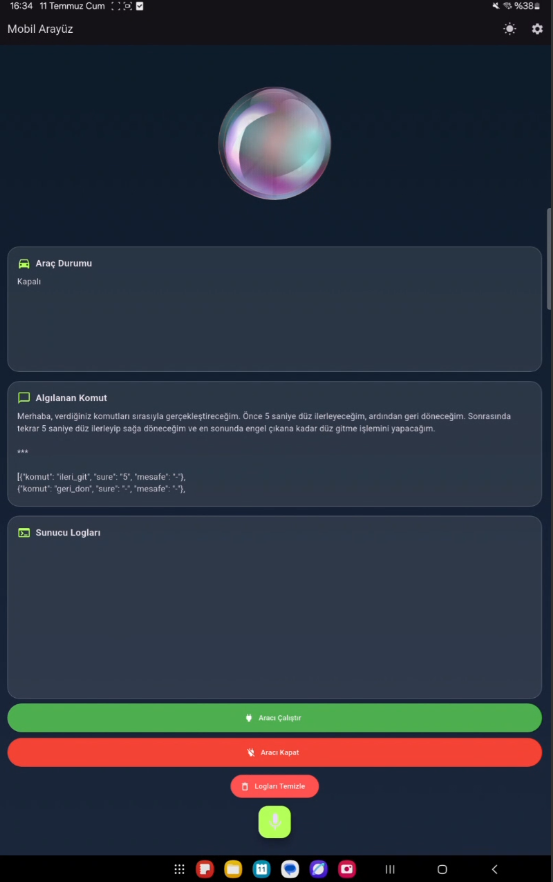

# TOBB ETÜ ELE495 - Capstone Project

# Table of Contents
- [Introduction](#introduction)
- [Features](#features)
- [Installation](#installation)
- [Usage](#usage)
- [Screenshots](#screenshots)
- [Acknowledgements](#acknowledgements)

## Introduction
This capstone project aims to develop a voice-controlled autonomous ground vehicle using Raspberry Pi 5. The system is designed to understand and execute natural spoken commands in Turkish, enabling hands-free interaction with the vehicle.

Voice input is captured via a Bluetooth microphone and transcribed using OpenAI Whisper. The resulting text is processed by a language model to extract command logic in JSON format, which is then used to control the vehicle’s movement through motor drivers.

The vehicle also includes an RFID-based authentication system to ensure only authorized users can operate it. A custom Flutter-based mobile application communicates with a Flask backend running on the Raspberry Pi, allowing users to monitor and manage the system remotely.

This project demonstrates the integration of speech recognition, natural language processing, embedded control systems, and mobile app development to create a fully autonomous and voice-interactive robotic platform.

## Features
1) Key Functionalities
    - Voice-Controlled Autonomy: The vehicle receives and processes Turkish voice commands to perform autonomous navigation tasks without manual input.
    - User Authentication via RFID: Only authorized users can operate the vehicle through RFID card validation.
    - Real-Time Mobile App Interface: Users can monitor vehicle status, command execution, and log messages via a Flutter-based mobile app.
    - Command Understanding via LLM: Natural language commands are interpreted and converted into actionable JSON structures by a language model.
    - Obstacle Detection and Avoidance: Ultrasonic sensor ensures safe navigation by detecting and reacting to nearby obstacles.
    - Direction-Aware Turning: Integrated gyroscope (MPU-6050) enables accurate rotational control during turns.

2) Hardware Components
    - Raspberry Pi 5 – The main processing unit.
    - Bluetooth Microphone – For wireless audio input.
    - MPU-6050 Gyroscope – For detecting angular movement and orientation.
    - HC-SR04 Ultrasonic Sensor – For distance measurement and obstacle detection.
    - L298N Motor Driver – Controls the vehicle's DC motors.
    - RC522 RFID Reader + Tags – Used for verifying authorized users.
    - DC Geared Motors – Enable forward/backward movement and turning.
    - Power Supply (3.7V x 3 serial 18650 Li-Ion battery) – Powers L298N motor driver.
    - Power Bank – Powers Raspberry Pi 5.
    - microSD Card – For OS and software storage.

3) Operating System & Packages
    - OS: Raspberry Pi OS (Bookworm)
    - Programming Language: Python 3.11
    - Key Python Libraries:
        - openai – For Whisper and GPT API access
        - sounddevice, scipy, ffmpeg – For audio recording and processing
        - speechbrain, resemblyzer – For speaker verification
        - RPi.GPIO, gpiozero – For motor and sensor control
        - flask, requests – For API and mobile interface
        - pyserial – For UART communication with RFID module

4) Applications
    - Voice-Based Vehicle Control: Enables hands-free vehicle operation using natural spoken commands.
    - Access Restriction via RFID: Prevents unauthorized use by requiring RFID authentication.
    - Mobile Monitoring App: Shows real-time system state, sensor logs, and command execution feedback.
    - Autonomous Driving Logic: Uses LLM output to control movement based on conditions (e.g., `“engel çıkana kadar ilerle”`).

5) Services
    - Speech Recognition Service: Converts live recorded audio to text using OpenAI Whisper.
    - Command Parsing Engine: Converts text commands into structured JSON control instructions using GPT-4.
    - Real-Time Flask API: Handles mobile app communication for sending/receiving commands and monitoring status.
    - Voice Feedback: Generates real-time spoken feedback using OpenAI TTS (`“Nova”` voice).
    - Speaker Verification: Ensures only known users can give commands using embedding-based audio comparison.

## Installation
1) Prerequisites
    - Raspberry Pi 5 (with internet access)
    - Raspberry Pi OS (Bookworm 64-bit) installed and bootable on a microSD card
    - SSH access or monitor + keyboard setup
    - Internet connection for package installations
    - A verified OpenAI API key
    - Android device with the mobile app (for remote control)

2) Hardware Connections
- Connect the following modules to the Raspberry Pi as per your wiring plan:
    - L298N Motor Driver: Connect ENA, ENB, IN1–IN4 to GPIO pins (e.g., 12, 13, 17, 18, 22, 23)
    - HC-SR04 Ultrasonic Sensor: Connect Trig and Echo to GPIO (e.g., GPIO5, GPIO6)
    - MPU-6050 Gyroscope: Connect to I2C pins (SDA = GPIO2, SCL = GPIO3)
    - RC522 RFID Reader: Connect via UART (e.g., GPIO14 TX, GPIO15 RX)
    - Bluetooth Microphone: Pair over Bluetooth via the GUI or bluetoothctl
    - Power Supply: 12V battery (L298N) + 5V step-down for Raspberry Pi
    > Ensure GPIOs are protected with voltage dividers, zener diodes, or opto-isolators if needed.

3) Software Setup
    1) Update System & Install Git
        ```bash
        sudo apt update
        sudo apt upgrade -y
        sudo apt install git python3-pip python3-venv -y
        ```
    2) Clone the Repository
        ```bash
        git clone https://github.com/ELE495-2425Summer/capstoneproject-automind-grup-14.git
        cd capstoneproject-automind-grup-14
        ```
    3) Create Virtual Environment (Optional but Recommended)
        ```bash
        python3 -m venv venv
        source venv/bin/activate
        ```
    4) Install Python Dependencies
        ```bash
        pip install -r requirements.txt
        ```
    - Alternatif olarak manuel yüklemek için:
        ```bash
        pip install openai flask sounddevice scipy numpy RPi.GPIO gpiozero pyserial speechbrain
        ```
        > ffmpeg paketinin sistemde kurulu olması gerekir.
        ```bash
        sudo apt install ffmpeg
        ```

4) Folder Structure
    - capstoneproject-automind-grup-14/
        - `mic_test.py`                # Microphone test script
        - `speech_to_text.py`          # Whisper-based voice transcription
        - `motor_surucu.py`            # Motor control logic
        - `openai_tts.py`              # Voice feedback generation using TTS
        - `server.py`                  # Flask backend server
        - `kayit_al.py`                # Live audio recording script
        - `canli_kayit_ve_tanima.py`   # Live speaker verification
        - `authorized_uids.txt`        # RFID authentication list
        - `requirements.txt`           # Dependency list

5) Running the Project
    1) Start the Flask server on Raspberry Pi:
        ```bash
        python3 server.py
        ```
    - (Optional) Run the live recording + verification daemon:
        ```bash
        python3 canli_kayit_ve_tanima.py
        ```
    - On the mobile app, send commands or start recording.
        > `canli_kayit_ve_tanima.py` will only activate if a valid RFID card was scanned and written to `arac_durum.txt`.

6) First-Time Setup Notes
    - Pair the Bluetooth microphone using GUI or bluetoothctl.
    - The Raspberry Pi must be connected to the RFID module via UART. `kayit_al.py` will detect and log authorized UID cards.
    - Ensure OpenAI API key is defined in your Python scripts or environment, openai.api_key = `“sk-...”`.

7) Additional Notes
    - All voice interactions are in Turkish.
    - Whisper API is used online.
    - Output logs are written to `server_log.txt`.
    - Animations and vehicle status are reflected in the Flutter-based mobile app.

## Usage
1) Power Up the System
    - Turn on your Raspberry Pi and ensure that the vehicle is powered via the battery for L298N motor driver.
    - Ensure your Bluetooth microphone and Bluetooth speaker is powered and connected.
    - Ensure the RFID reader is wired and positioned properly.

2) Start the Flask Server
    - Server handles mobile app communication and triggers the listening pipeline.
    - Once the server is running, the mobile app can send commands to start voice recording. `flask_basla.txt` trigger file will be created automatically to signal audio capture.

3) Authenticate the User (RFID)
    - Only authorized users can activate the system. Place an authorized RFID card near the reader.
    - If the UID matches a known user, the system writes `“araç çalıştı”` to `arac_durum.txt`.
    > Unauthorized cards will be rejected. You can edit allowed UIDs in `authorized_uids.txt`.

4) Start Continuous Background Listener (Optional)
    - To always keep the vehicle ready for speech recognition upon valid RFID and signal:
    ```bash
    python3 canli_kayit_ve_tanima.py
    ```
    - This script monitors `flask_basla.txt`.
    - When the file says `“basla”`, it begins recording and sends audio to Whisper for transcription and to Speaker ID system for user check.

5) Voice Command Workflow (Automatic)
    - After background listener is triggered, audio is recorded with sounddevice. The file is saved locally, converted to .wav, and checked with speechbrain or Resemblyzer for user identity.
    - If voice is verified, whisper transcribes the command (e.g., `“engel çıkana kadar düz git”`).
    - GPT model parses the transcription into JSON like `{"komut": "ileri_git", "kosul": "engel_algilayana_kadar"}`.
    - `motor_surucu.py` receives the JSON and moves the vehicle accordingly.
    - Voice feedback is generated with OpenAI TTS (`“Nova”`) and played, e.g., `“ileri gidiyorum”`.

6) Monitor the System
    - All actions and logs are saved in:
        - `server_log.txt` – full log
        - `transkript.txt` – recognized voice command
        - durum.txt – current vehicle state
    - Logs can be tailed,
        ```bash
        tail -f server_log.txt
        ```

7) Example Commands
    - Start the Flask server
        ```bash
        python3 server.py
        ```
    - Authenticate and allow vehicle
        ```bash
        python3 kayit_al.py
        ```
    - Start background listening loop
        ```bash
        python3 canli_kayit_ve_tanima.py
        ```
    - Force speech recognition manually (for debug)
        ```bash
        python3 speech_to_text.py
        ```

8) Mobile App Usage
    - Connect to the same Wi-Fi network as the Raspberry Pi.
    - Enter the Raspberry Pi IP in the app.
    - Press the `“dinlemeye başla”` button.
    - Say a command like, `“geri dön ve sağa dön”`.
    - The app will show command log and status animations.

9) Stopping the System
    - Press CTRL+C in the terminal where `canli_kayit_ve_tanima.py` is running. Or delete the `flask_basla.txt` file manually.

- Notes
    - Ensure your OpenAI API key is correctly set in openai.api_key field.
    - Ensure ffmpeg is installed for audio file conversion.
        ```bash
        sudo apt install ffmpeg
        ```
    - Avoid background noise during voice recognition.

## Screenshots
Mobile Application Interface



Project Demo Video

https://www.youtube.com/watch?v=dupXn58BU14&ab_channel=Graficco

## Acknowledgements
This project was made possible through the collaboration of our dedicated team members and the use of several open-source tools and platforms. We would like to express our sincere gratitude to everyone who supported and contributed to the development process.

- Contributors
    - [Ömer Faruk İnciler](https://github.com/ofarukinciler)
    - [Alperen Nakiboğlu](https://github.com/alpnak)
    - [Enis Hacışevki](https://github.com/Ezohc)
    - [Emre Uluçay](https://github.com/Emreu234)
    - [Bora Saltaş](https://github.com/borasaltas)

Special thanks to our academic advisor Dr. Ali Murat Demirtaş for his continuous guidance and feedback throughout the project.

- Tools and Resources
    - [Raspberry Pi Foundation](https://www.raspberrypi.org/) – for the development platform and GPIO ecosystem
    - [OpenAI Whisper & GPT APIs](https://platform.openai.com/) – for transcription and natural language understanding
    - [gpiozero](https://gpiozero.readthedocs.io/en/stable/) – for controlling Raspberry Pi hardware easily
    - [sounddevice](https://python-sounddevice.readthedocs.io/en/0.5.1/) – for live audio capture
    - [SpeechBrain](https://speechbrain.readthedocs.io/en/latest/) – for speaker verification
    - [Resemblyzer](https://github.com/resemble-ai/Resemblyzer) – for alternative lightweight voice authentication
    - [Flask](https://flask.palletsprojects.com/en/stable/) – for REST API and mobile backend
    - [Flutter](https://flutter.dev/) – for building the mobile interface

We gratefully acknowledge the use of the above technologies, libraries, and platforms. We would also like to thank the open-source community, whose documentation, libraries, and examples were crucial to the success of this project.